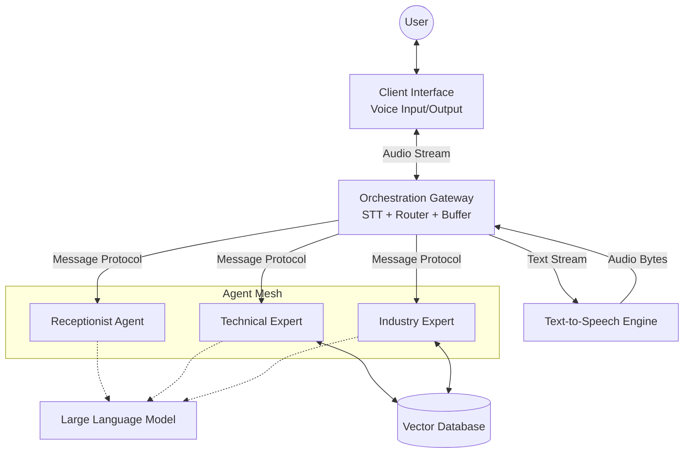

# Multi-Agent Voice Orchestration System

> **Orchestrating Intelligent Conversations with Microsoft Agent Framework**

This project implements a sophisticated voice-enabled multi-agent system designed for seamless handoff orchestration. It leverages **Microsoft Agent Framework** to manage a mesh of specialized agents (Receptionist, Technical Expert, Industry Expert), providing intelligent, context-aware responses via a voice interface.

## 🚀 Key Features

-   **Voice-First Interface**: Real-time voice interaction using **OpenAI Whisper** (STT) and **VibeVoice** (TTS).
-   **Intelligent Orchestration**: A central gateway manages conversation flow, routing requests to the appropriate agent.
-   **Multi-Agent Handoff**: Seamless transition between agents:
    -   **Receptionist Agent**: Handles general inquiries and initial triage.
    -   **Technical Expert**: Deep domain knowledge for specific technical queries.
    -   **Agriculture Expert**: Specialized knowledge for agriculture-specific context.
-   **Robust Backend**: Built on **FastAPI** for high performance and easy integration.
-   **Advanced Audio Processing**: **Silero VAD** ensures accurate voice activity detection for natural turn-taking.

---

## 🏗️ Architecture Overview

The system architecture follows a modular design as depicted in the project flowchart:



### Component Breakdown

1.  **Client Interface**: Captures user voice input and plays back synthesized audio.
2.  **Orchestration Gateway**:
    -   **VAD (Silero)**: Detects when the user starts/stops speaking.
    -   **STT (Whisper)**: Transcribes audio to text.
    -   **Router**: Determines which agent should handle the request based on intent.
    -   **Buffer**: Manages audio/text streams for smooth processing.
3.  **Agent Mesh (Microsoft Agent Framework)**:
    -   **Receptionist**: The entry point agent. It classifies intent and hands off complex queries to experts.
    -   **Technical Expert**: Handles detailed technical questions, retrieving data from the **Vector Database**.
    -   **Industry Expert**: Provides high-level industry insights, also utilizing the knowledge base.
4.  **Intelligence Layer**:
    -   **LLM**: Powers the reasoning and generation capabilities of all agents.
    -   **Vector Database**: Stores embeddings for RAG (Retrieval-Augmented Generation).
5.  **Output Layer**:
    -   **TTS (VibeVoice)**: Converts the agent's text response back into natural-sounding speech.

---

## 🛠️ Tech Stack & Dependencies

This project relies on a robust set of libraries and frameworks. Key components include:

-   **Core Framework**: `agent-framework` (Microsoft Agent Framework)
-   **Backend**: `fastapi`, `uvicorn`
-   **Speech-to-Text (STT)**: `faster-whisper`, `openai`
-   **Text-to-Speech (TTS)**: `vibevoice` (Custom/Local implementation)
-   **Voice Activity Detection (VAD)**: `silero` (via `torch`/`torchaudio`)
-   **AI & LLM Integration**: `azure-ai-agents`, `langchain-core`, `openai`, `anthropic`
-   **Data & Storage**: `chromadb`, `redis`, `azure-search-documents`
-   **Utilities**: `pydantic`, `numpy`, `websockets`, `python-dotenv`

> **Note**: This project is configured to run in the `maf_a2a` virtual environment.

---

## 📂 Project Structure (Recommended)

Since this is a fresh setup, we recommend the following directory structure:

```text
Multi_Agent_MAF_Handoff_new/
├── app/
│   ├── agents/                 # Agent definitions (Receptionist, Experts)
│   │   ├── receptionist.py
│   │   ├── technical_expert.py
│   │   └── industry_expert.py
│   ├── core/                   # Core logic (Orchestrator, Config)
│   │   ├── orchestration.py
│   │   └── config.py
│   ├── services/               # STT, TTS, VAD services
│   │   ├── stt_service.py      # Whisper integration
│   │   ├── tts_service.py      # VibeVoice integration
│   │   └── vad_service.py      # Silero integration
│   └── main.py                 # FastAPI entry point
├── .env                        # Environment variables (API Keys, Config)
├── requirements.txt            # Project dependencies
└── README.md                   # Project documentation
```

---

## 🚀 Setup & Installation

### 1. Prerequisites

Ensure you have the `maf_a2a` virtual environment available (as listed in your system).

### 2. Activate Virtual Environment

**Windows (PowerShell):**
```powershell
# Assuming the venv is in a standard location or managed by a tool like conda/virtualenvwrapper works
# If it's a raw venv folder:
.\maf_a2a\Scripts\Activate.ps1
```

### 3. Environment Configuration

Create a `.env` file in the root directory to store your credentials:

```ini
# API Keys
OPENAI_API_KEY=your_openai_api_key
AZURE_OPENAI_API_KEY=your_azure_key
AZURE_OPENAI_ENDPOINT=your_azure_endpoint

# Service Configuration
TTS_MODEL_PATH=path/to/vibevoice/model
WHISPER_MODEL_SIZE=base
```

### 4. Running the Application

Start the FastAPI server using `uvicorn`:

```bash
uvicorn app.main:app --reload --host 0.0.0.0 --port 8000
```

The API will be available at `http://localhost:8000`. You can access the automatic documentation at `http://localhost:8000/docs`.

---

## 🧩 Agent Workflow

1.  **Initalization**: The system loads the `Receptionist` agent as the default active agent.
2.  **Listening**: The `Orchestration Gateway` uses Silero VAD to detect speech segments.
3.  **Transcribing**: Detected speech is sent to Whisper for transcription.
4.  **Routing**:
    -   The `Receptionist` analyzes the text.
    -   **Simple Query?** -> Receptionist responds directly.
    -   **Technical?** -> System hands off to `Technical Expert`.
    -   **Industry Specific?** -> System hands off to `Industry Expert`.
5.  **Response**: The active agent generates a response.
6.  **Synthesis**: The response is converted to audio via VibeVoice and streamed back to the client.

---
